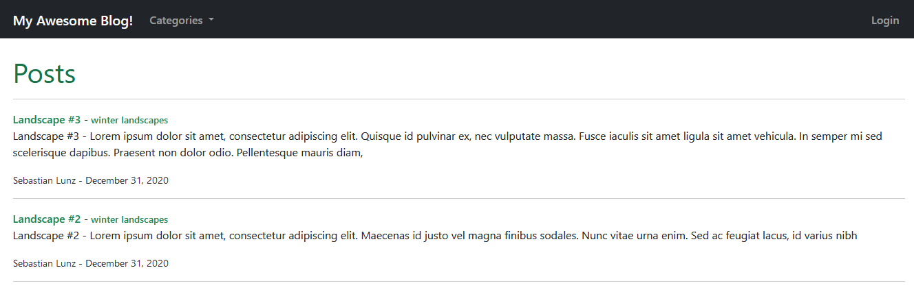
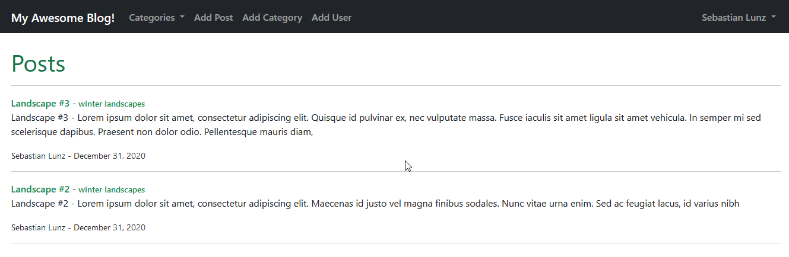

# My Awesome Blog - blog app
A blog app created with Django, Bootstrap and SQLite3
## Functionality
### Not logged user:

* Viewing list of posts
* Viewing post details
* Viewing categories of posts
* Adding comments
### Logged user:

#### Additional functionality (enabled from the website) :
* Add/Delete/Edit posts
* Add category
* Add users
